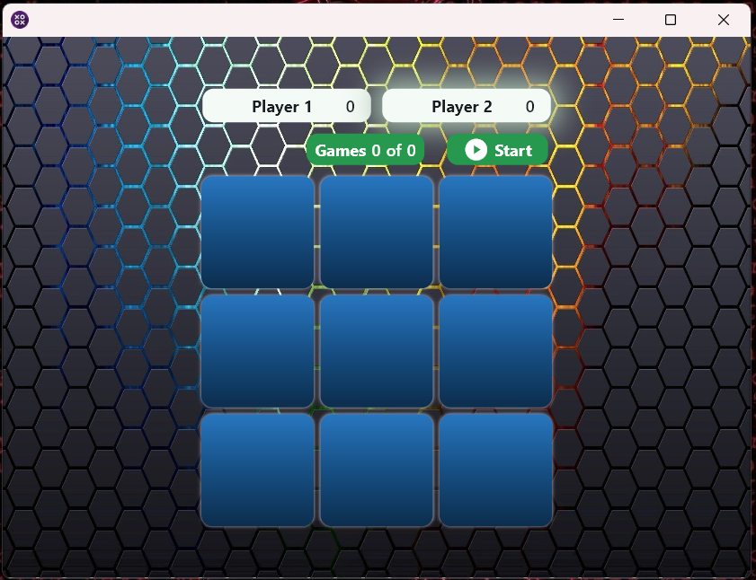
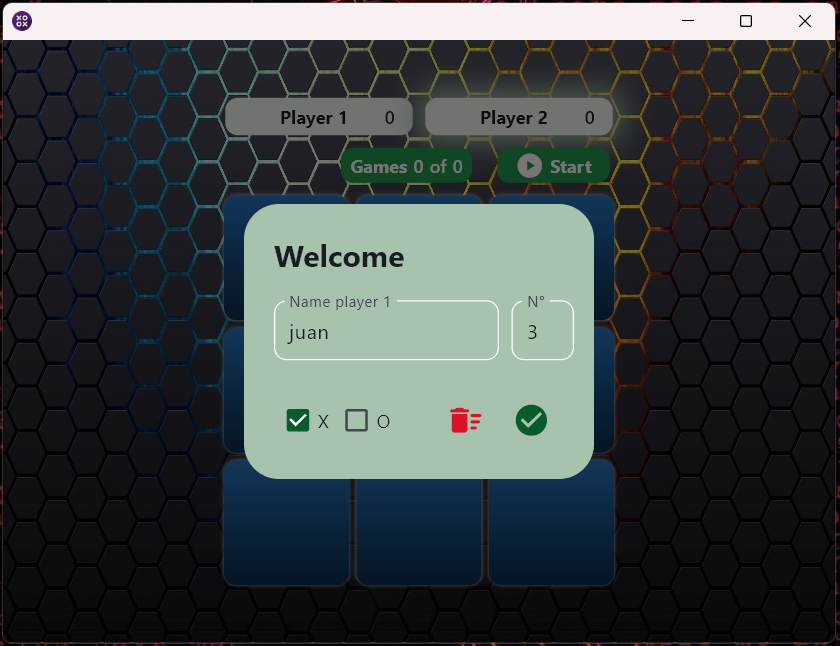
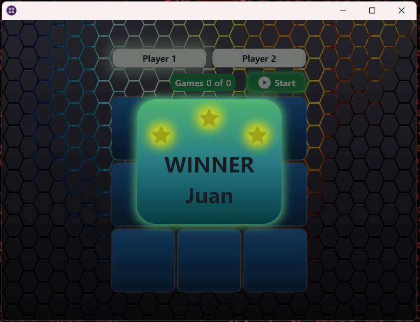

# Tic Tac Toe

## Descripción

Para jugar priemero se debe ingresar los nombres de los jugadores, se ingresa el numero de partidas luego se oprime start y se inicia el juego. Para ganar se debe completar tres figuras iguales de forma vertical, horizontal o diagonal y ademas haber ganado mas partidas que el otro jugador hasta completar el total de las partidas.

## Imagenes

